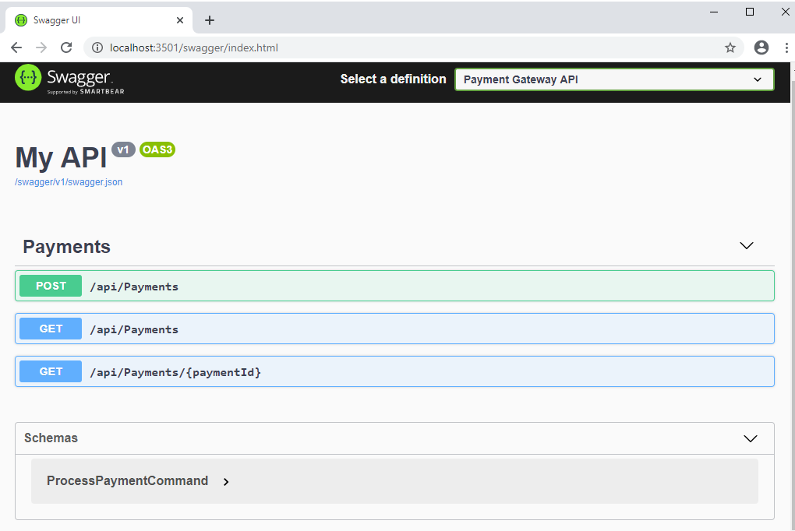
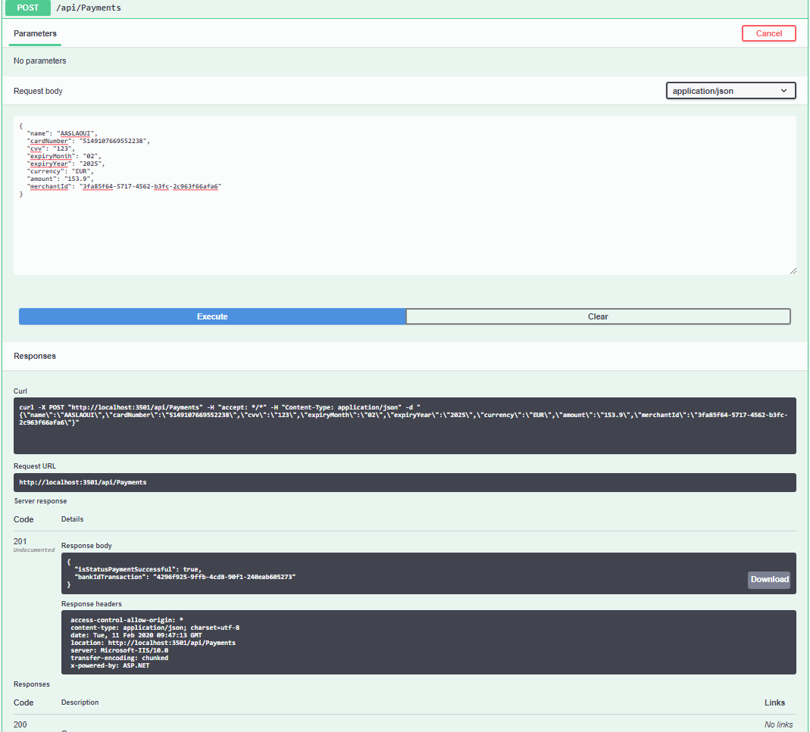
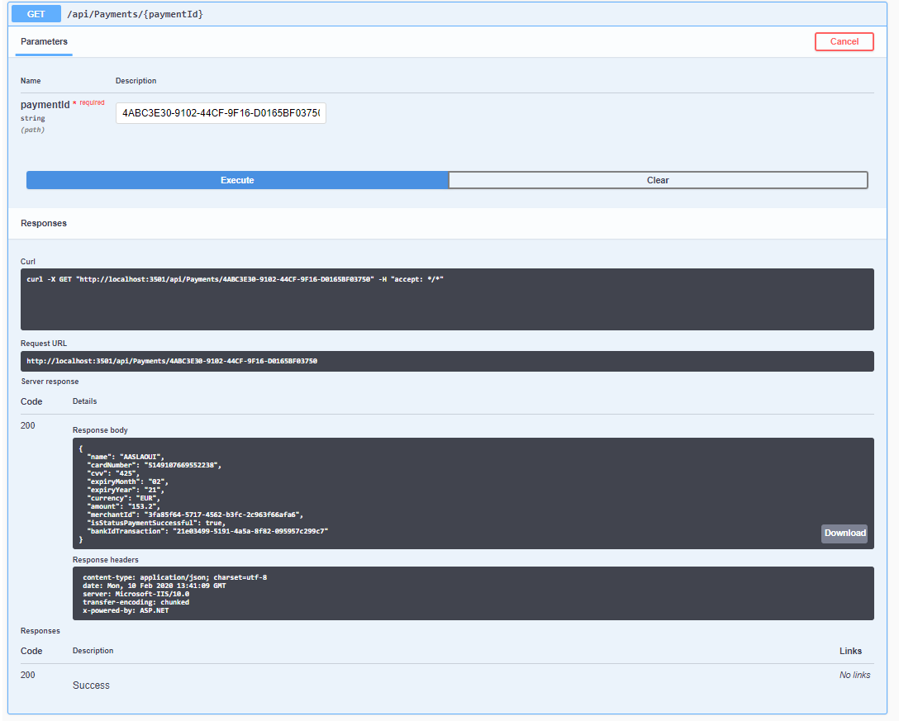
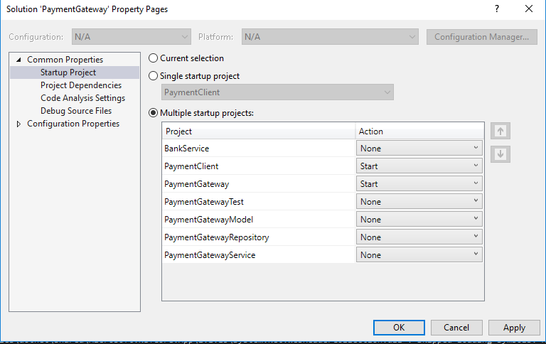
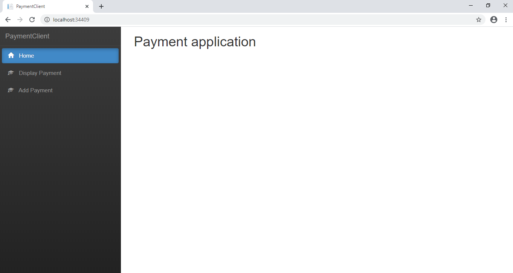

# PaymentGateway Api .Net Core 3.0 with CQRS and Solid patterns

This is a solution to simulate a payment process, its include an APi .net core and a ReactJS client to consume this API.
The API will allow a mechant to offer for their shoppers a way to pay for their product.

## Requirements
The product requirements for this initial phase are the following:
1. A merchant should be able to process a payment through the payment gateway and receive either a
successful or unsuccessful response
2. A merchant should be able to retrieve the details of a previously made payment

### Process a payment
The payment gateway will need to provide merchants with a way to process a payment. To do this, the
merchant should be able to submit a request to the payment gateway. A payment request should include
appropriate fields such as the card number, expiry month/date, amount, currency, and cvv.

Note: Simulating the bank
In this solution  we mock out the Bank part of processing flow This component should be able to be switched out for a real bank once we move into
production. We should assume that a bank response returns a unique identifier and a status that
indicates whether the payment was successful.

### Retrieving a payment’s details
The second requirement for the payment gateway is to allow a merchant to retrieve details of a
previously made payment using its identifier. Doing this will help the merchant with their reconciliation
and reporting needs. The response should include a masked card number and card details along with a
status code which indicates the result of the payment.

## Packagages:

  ####    - .Net core 3.0
  ####    - MediatR 8.0
  ####    - EntityFrameworkCore.SqlServer 
  ####    - Swagger (Swashbuckle) 5.0
  ####    - Microsoft.Extensions.Logging.Debug 3.0
  ####    - Automapper 7.0

## Installation:
- Firt you need to create a database "PaymentDB" for this solution or another one and chnage the configuration in  appsettings.json.
- Run the "Create_Payment_Table" script to create the table 

## How to make it run :
## 1- Test the API with Swagger
- In the APi project there Swagger configured so to test the API methods you can use it directly from this URL : http://localhost:3501/swagger/index.html
you will need to change the  PortNumber:

- ### Create Payment :

- ### Retrieve Payment :

## 2- Run the ReactJS CLient:
for this purpose you need to run the API and the ReactCLient application so you should setup multiples startups projects

### React Client

